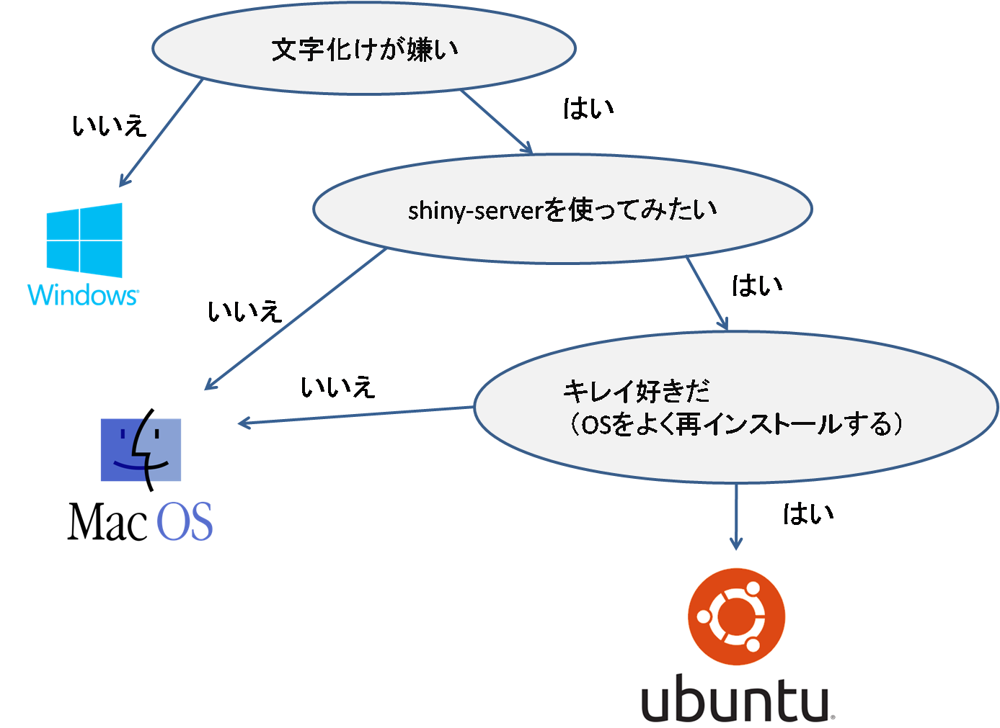
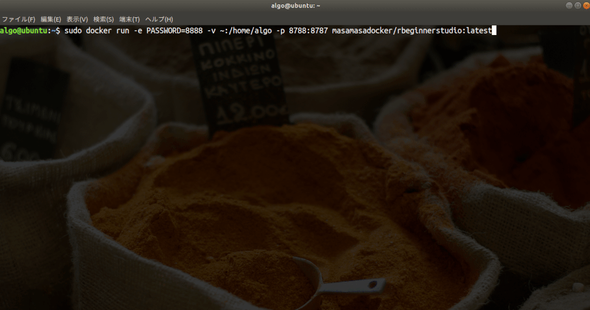

###   

---
### 自己紹介

- @fa[twitter fa-2x twitter-blue] @R_beginner


---
### shinyによる電子カルテ補助システム

- 電子カルテに欲しい機能はRでつくる
- shiny-serverにのせて、24時間運用、<br>（Rstudioの邪魔にならない）

+++
### <i class="em em-gift">test</i>

@snap[north-west span-40]
### Q: How can you tell if a computer @color[#e49436](geek) is an extrovert?
@snapend

@snap[north-east span-50]
#### A: They stare at **your shoes** when you talk instead of their own<sup>1</sup>.
@snapend

@snap[south span-100]
@size[0.5em](1. Any similarity to actual persons, living or dead, is purely coincidental!)
@snapend

@snap[east]
@fa[smile-o fa-5x]
@snapend


+++
### 診察待ち患者アラート

  

+++
### 体重経過と必要栄養量

  

+++
### eGFRプロット

  

+++
### Flu患者数

  

+++
### library path

  

+++
### patient map

  

+++
### clinic map

  

+++
### mayoPBCmodel

  

+++
### MELD

  

+++
### predict Liver Transplant

  

+++
### pyramid

  

+++
### pyramid DM

  

+++
### Rmarkdown

  

+++
### Rmarkdowm2

  

+++
### yoyaku

  


---
### 今日はDockerとRstudio設定の話


---
### Dockerにおまかせ


+++
### コンテナって何ですか？


---
### 本日の内容

1. dockerのインストール
2. Dockerfileの書き方
3. build
4. push
5. run
6. オレオレdocker image

---
### dockerのインストール


+++
### あなたに合うOSは？



+++
### install docker on Ubuntu18.04LTS
エディターに下記をコピペして、`hogehoge.sh`か何かで保存。実行は`sh hogehoge.sh`
```
#!/bin/sh

sudo apt-get update    # 前提ソフトウェアのインストール
sudo apt-get install -y \
    apt-transport-https \
    ca-certificates \
    curl \
    software-properties-common
curl -fsSL https://download.docker.com/linux/ubuntu/gpg | sudo apt-key add -    # GPG 公開鍵のインストール
sudo apt-key fingerprint 0EBFCD88  # 公開鍵のフィンガープリントを確認
sudo add-apt-repository \   # aptリポジトリの設定(x86_64)
   "deb [arch=amd64] https://download.docker.com/linux/ubuntu \
   $(lsb_release -cs) \
   stable"
sudo apt-get update
sudo apt-get install -y docker-ce
```

---
### Dockerfileの書き方


---
### build


+++
### push 

  


+++?image=img/DockerRun2.gif
### <font size="7" color="yellow">３倍早送りでdocker run中</font><br><font size="5" color="yellow">（実際は1分半ぐらい）</font>


+++
### run

 


+++?color=#6b8e23
### 非アルコール性脂肪性肝炎(NASH)

- 1980年Ludwigが、多飲酒歴がないにもかかわらず、肝硬変に進行した20症例を検討し報告した。

<p id="p_small_white">Ludwig J,et al :Mayo Clin Proc 1980;55:434-438 
</p>


+++ 
### <font id='p_120_orange'>NAFLD</font> + HCC症例(70歳代、男性)

<div id="column1">
  
</div>
<div id="column2">
<p id="p_80"> 6年前より高血圧症にて加療。初診時、腹部USにて脂肪肝を指摘。
<br><br>3年前の腹部USにて、肝S5：直径20mmの肝細胞癌を認め、ラジオ波焼灼術施行。
<br><br>以後、再発無く経過。
</p>
</div>


---
### <font id='p_120_orange'>NAFLD</font>の問題点

+++
### <font id='p_120_orange'>NAFLD</font>の問題点

- 生活習慣の変化により<font id='p_bold'>患者数が増加</font>傾向
- <font id='p_120'>10～20</font>年で、<font id='p_120'>5～8</font>％が<font id='p_bold'>肝硬変へ進展</font>
- 肝硬変からの<font id='p_bold'>肝発癌</font>率は<font id='p_120'>5</font>年で<font id='p_120'>11.3</font>％


+++
### <font id='p_120_orange'>NAFLD</font>有病率

- 日本の成人健康診断受診者でのNAFLDの頻度は，<br><font id='p_bold'>男性</font>では<font id='p_120_bold'>30～40</font>％，<font id='p_bold'>女性</font>は<font id='p_120_bold'>10～20</font>％である。
- NAFLDの10～20％がNASHと報告されているので，<font id='p_bold'>NASH有病率</font>は成人の2～8％(<font id='p_120_bold'>160-640</font>万人)と推定される。

+++
### <font id='p_120_orange'>NAFLD</font>患者、年齢分布

  
<p id="p_small_gray">
Eguchi Y, et al :  J Gastroenterol 47 : 586―595,2012
</p>

+++
### BMIの年齢階級分布

  
<p id="p_small_gray">
e-stat(政府統計ポータルサイト)の平成２７年国民健康・栄養調査データから作成
</p>

+++
### 肝臓の腹腔鏡像

  

+++
### 肝発癌率<font id='p_120'>(HCV vs NASH)</font>


<p id="p_small_gray">(日内会誌　105：62～66，2016)</p>


---
### <font id='p_120_orange'>NAFLD</font>の最近の話題


+++
### <font id='p_120_orange'>NAFLD</font>の肝外合併症  

- 心血管イベント
- 慢性腎臓病
- 糖尿病

+++
### <font id='p_120_orange'>NAFLD</font><font id='p_80'>における心血管イベント</font>


<p id="p_small_gray">(日内会誌　105：38～46，2016)</p>

+++
### <font id='p_120_orange'>NAFLD</font><font id='p_80'>の心血管イベントに与える影響<br>－メタ解析－</font>


<p id="p_small_gray">
(Musso G, et al : Ann Med 43 : 617―649, 2011.)
</p>

+++
### <font id='p_120_orange'>NAFLD</font><font id='p_80'>における<br>慢性腎臓病（CKD）の報告</font>


<p id="p_small_gray">(日内会誌　105：38～46，2016)</p>

+++
### <font id='p_120_orange'>NAFLD</font><font id='p_80'>の糖尿病発症に与える影響<br> － メタ解析 －</font>


<p id="p_small_gray">
(Musso G, et al :  Ann Med 43 : 617―649, 2011.)
</p>

+++
### <font id='p_120_orange'>NAFLD</font>診療のポイント


---
### <font id='p_120_orange'>NAFLD</font>の診断

+++
### <font id='p_120_orange'>NAFLD</font>診断フローチャート

  

+++
### <font id='p_120_orange'>NAFLD</font>の病理

  

<p id="p_small_gray">Type 1～3はHE染色，Type 4はアザンマロリー染色（矢印は風船様腫大）</p>

+++
### <font id='p_120_orange'>NAFLD</font>全員に、肝生検するのは無理 

+++
### <font id='p_orange'>NAFLD</font><font id='p_80'>における肝線維化と血小板の関連</font>

  

<p id="p_small_gray">(Yoneda M, et al : J Gastroenterol 46 :
1300―1306, 2011.)</p>

+++
### <font id='p_orange'>NAFLD</font><font id='p_80'>における肝線維化と</font><font id='p_bold'>M2BPGi</font><font id='p_80'>の関連</font>

  

<p id="p_small_gray">(Abe M, et al :  J Gastroenterol 50 : 776―784, 2015.)</p>

+++
### <font id='p_80'>肝線維化スコアリングシステム</font>

  

<p id="p_small_gray">(日本内科学会雑誌105巻1号より引用)<br>
(Sumida Y, et al : BMC Gastroenterol 12 : 2, 2012.)</p>

+++ 
### <font id='p_120'>FibroScan</font>

 

<p id="p_small_gray">www.fibrscan.com/en/products</p>

---
### <font id='p_120_orange'>NAFLD</font>の治療

+++
### <font id='p_120_orange'>NAFLD</font>診療ガイドライン

 

<p id="p_small_gray">https://www.jsge.or.jp/guideline/guideline/pdf/NAFLD_NASHGL2_re.pdf</p>


+++
### <font id='p_80'>ガイドラインに記載された薬物治療</font>

<p id="p_60">エビデンス<br>レベル</p>     |    <p id="p_60">薬剤</p>　
-----------------------|------------------------
<p id="p_60">A</p>     |   <p id="p_60">チアゾリジン誘導体（ピオグリタゾン）・<br>ビタミンE</p>
<p id="p_60">B</p>     |   <p id="p_60">ビグアナイド（メトフォルミン等）・<br>HMG-CoA還元酵素阻害剤・高用量UDCA</p>
<p id="p_60">C</p>     |   <p id="p_60">エゼチミブ（ゼチーア）・ARB・瀉血</p>


+++
### 治療効果が期待される薬剤

- <font id='p_120_orange'>SGLT2阻害薬</font>
- <font id='p_120'>GLP-1受容体作動薬</font>

+++
### <font id="p_80">脂肪肝を伴う２型糖尿病患者に対する</font><font id="p_bold">Luseogliflozin</font><font id="p_80">と</font><font id="p_bold">Metformin</font><font id="p_80">の</font><font id="p_bold">RCT</font>

 

<p id="p_small_gray">
(Shibuya T, et al : Diabetes Obes Metab 20:438-442,2018.)
</p>

Note:
ルセフィー

+++
### <font id="p_80">２型糖尿病を伴う</font><font id='p_orange'>NAFLD</font><font id="p_80">に対する</font><br><font id="p_bold">Ipragliflozin</font><font id="p_80">と</font><font id="p_bold">Pioglitazone</font><font id="p_80">の</font><font id="p_bold">RCT</font>

 

<p id="p_small_gray">
(Ito D, et al : Diabetes Care 40:1364-1372,2017.)
</p>

Note:
スーグラ

+++
### <font id="p_80">２型糖尿病を伴う</font><font id='p_orange'>NAFLD</font><font id="p_80">に対する</font><br><font id="p_bold">Empagliflozin</font><font id="p_80">の</font><font id="p_bold">RCT</font>

 

<p id="p_small_gray">
(Kuchay MS, et al : Diabetes Care 41, 2018.)
</p>

Note:
ジャディアンス

+++
### <font id="p_bold">SGLT2i</font><font id="p_80">が著効した</font><font id='p_orange'>NAFLD</font><font id="p_80">症例(60歳代、男性)</font>

 


---
### 当院での<font id='p_120_orange'>NAFLD</font>診療

+++
### 院内<font id='p_130'>Network</font>
　　
 


+++
### 診療のポイント

- <p>肝外合併症のスクリーニング</p>
- <p>肝癌のスクリーニング</p>
- <p id="p_orange">脂肪化・線維化のフォロー</p>


+++
### Steatosis(脂肪化)

+++
### <font id="p_bold">一般的な<font id="p_120">US</font>による脂肪化グレード</font>

 

+++
### 肝脂肪定量化アプリ

 

+++
### Fibrosis(線維化)

+++
### 肝線維化スコアは計算が煩雑

 


+++
### 肝線維化スコア計算アプリ

 

+++
### <font id='p_130'>FIB4index</font>の経時的プロット

 

---?color=#6b8e23
### <font id='p_120_normal'>1980</font><font id='p_normal'>年に</font><font id='p_120_normal'>Ludwig</font><font id='p_normal'>が</font><font id='p_120_normal'>NASH</font><font id='p_normal'>を提唱し</font><br><font id='p_120_normal'>40</font><font id='p_normal'>年近く経ちました.<br>私達、肝臓内科医が学んだことは…</font>


+++?color=#6b8e23
### まとめ

- NAFLDは、10-20年で5～8％が肝硬変へ進展<br>肝硬変からの肝発癌率は5年で11.3％
- 肝線維化評価には、Fibroscan、線維化マーカー、線維化スコアが有用
- 心血管イベント、CKD、糖尿病発症のオッズ比はそれぞれ、2.05、1.5-4.4、3.51
