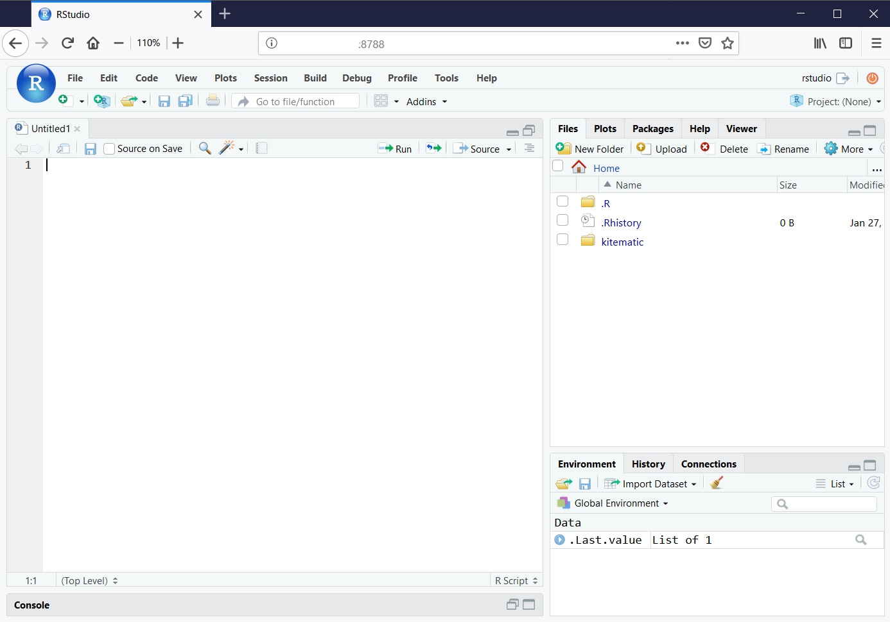
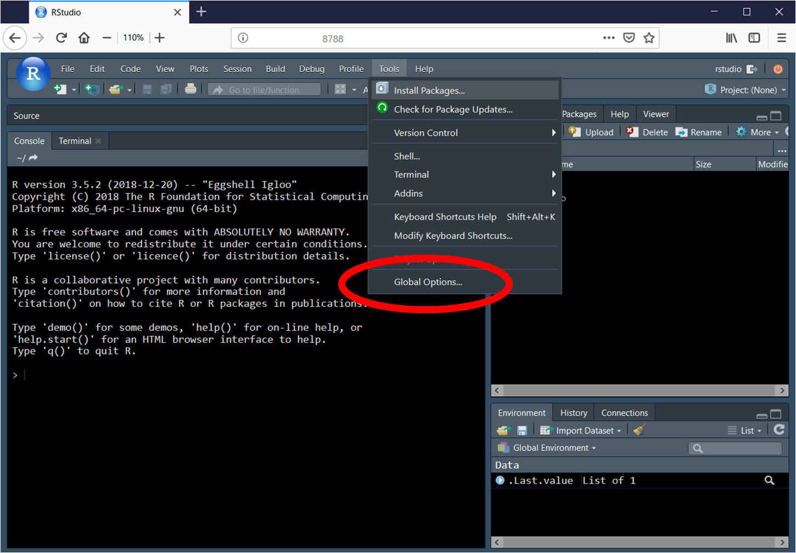
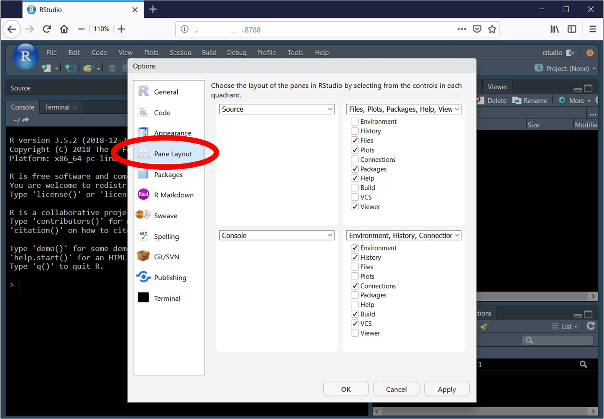
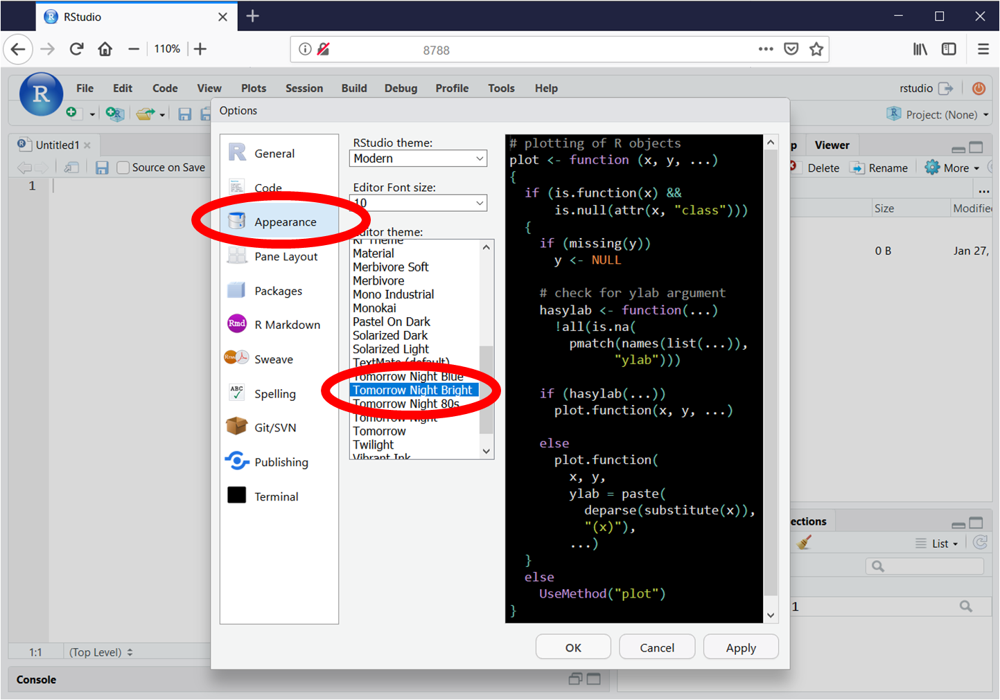
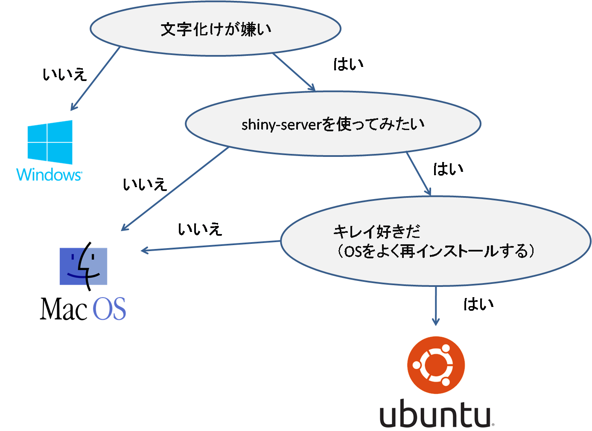
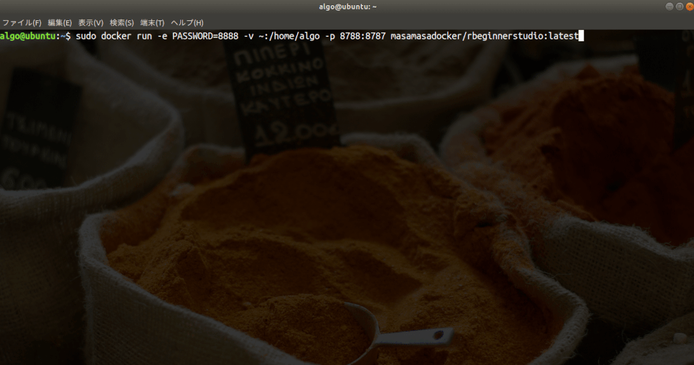

###   

---
### Rstudioの準備って時間かかりませんか？

- R, Rstudioのインストール
- Rパッケージのインストール（結構長い）
- Rstudioの設定（フォントサイズ、エディターテーマ、ペインレイアウト、キーバインド）
- r.snippetsの設定（.R/snippets/）

+++
### Rパッケージのインストール

gif動画

+++
### Rstudioのデフォルト設定

  

+++
### Rstudioの設定

  

+++
### Rstudioのペインレイアウト

  

+++
### Rstudioのテーマ

  


+++
### Rstudioのスニペット

---
### 今日はDockerとRstudio設定の話


---
### Dockerにおまかせ


+++
### コンテナって何ですか？


---
### 本日の内容

1. dockerのインストール
2. Dockerfileの書き方
3. build
4. push
5. run
6. オレオレdocker image

---
### dockerのインストール


+++
### あなたに合うOSは？



+++
### install docker on Ubuntu18.04LTS
エディターに下記をコピペして、`hogehoge.sh`か何かで保存。実行は`sh hogehoge.sh`
```
#!/bin/sh

sudo apt-get update    # 前提ソフトウェアのインストール
sudo apt-get install -y \
    apt-transport-https \
    ca-certificates \
    curl \
    software-properties-common
curl -fsSL https://download.docker.com/linux/ubuntu/gpg | sudo apt-key add -    # GPG 公開鍵のインストール
sudo apt-key fingerprint 0EBFCD88  # 公開鍵のフィンガープリントを確認
sudo add-apt-repository \   # aptリポジトリの設定(x86_64)
   "deb [arch=amd64] https://download.docker.com/linux/ubuntu \
   $(lsb_release -cs) \
   stable"
sudo apt-get update
sudo apt-get install -y docker-ce
```

---
### Dockerfileの書き方


---
### build


+++
### push 

  


+++?image=img/DockerRun2.gif
### <font size="7" color="yellow">３倍早送りでdocker run中</font><br><font size="5" color="yellow">（実際は1分半ぐらい）</font>


+++
### run

 
